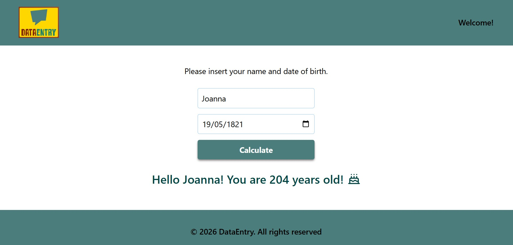

Data Entry - Age Calculator App 🎂

Μια απλή και λειτουργική εφαρμογή κατασκευασμένη με React, TypeScript και Tailwind CSS. Ο χρήστης εισάγει το όνομά του 
και την ημερομηνία γέννησής του, και η εφαρμογή υπολογίζει και εμφανίζει την τρέχουσα ηλικία του με ένα φιλικό μήνυμα.

✨ Χαρακτηριστικά
Υπολογισμός Ηλικίας: Ακριβής υπολογισμός με βάση την τρέχουσα ημερομηνία.

TypeScript: Type-safety για αξιόπιστο κώδικα και λιγότερα σφάλματα.

Tailwind CSS: Μοντέρνο και responsive design που προσαρμόζεται σε κάθε οθόνη.

Validation: Έλεγχος εγκυρότητας των δεδομένων εισόδου.

🛠️ Τεχνολογίες
React - Frontend library

TypeScript - Static typing

Tailwind CSS - Styling

Vite

Git/GitHub - Version control

🚀 Εγκατάσταση και Τοπική Εκτέλεση
Για να τρέξεις το project τοπικά, ακολούθησε τα παρακάτω βήματα:

Κάνε clone το repository:

Bash

git clone https://github.com/Jeanne9999/sev-data-input-project.git
cd το-repo-σου
Εγκατάσταση εξαρτήσεων (dependencies):

Bash

npm install
Εκκίνηση της εφαρμογής:

Bash

npm run dev
Η εφαρμογή θα είναι διαθέσιμη στο http://localhost:5173 (ή στη θύρα που ορίζει το Vite/CRA).

📸 Στιγμιότυπα (Screenshots)

📝 Παράδειγμα Λειτουργίας
Αν ο χρήστης εισάγει:

Όνομα: Γιώργος

Ημερομηνία Γέννησης: 15/05/1995

Το αποτέλεσμα θα είναι:

"Γεια σου Γιώργο! Είσαι 28 ετών."
